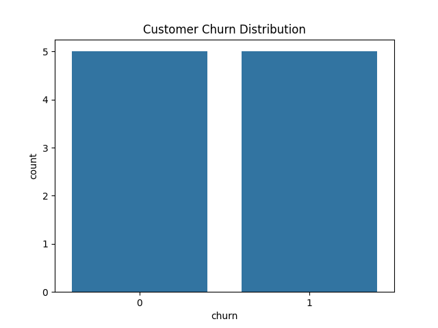
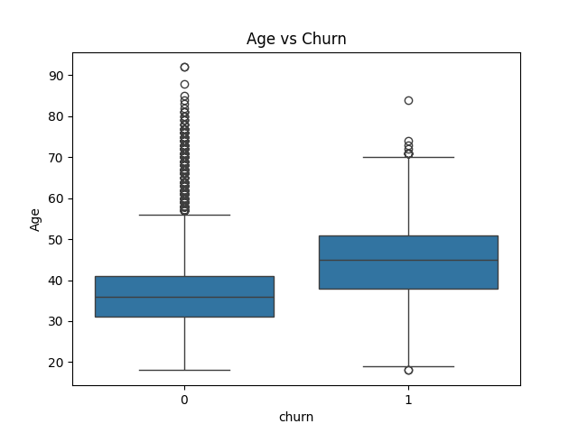
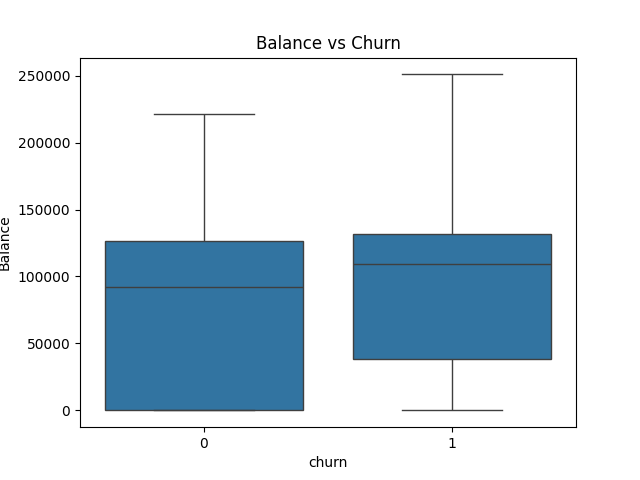
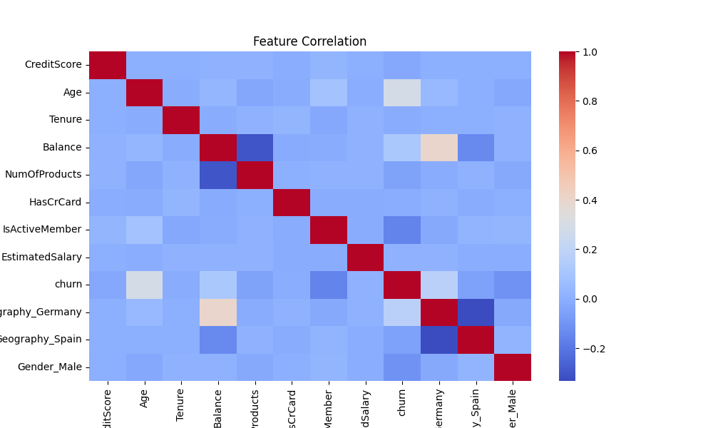
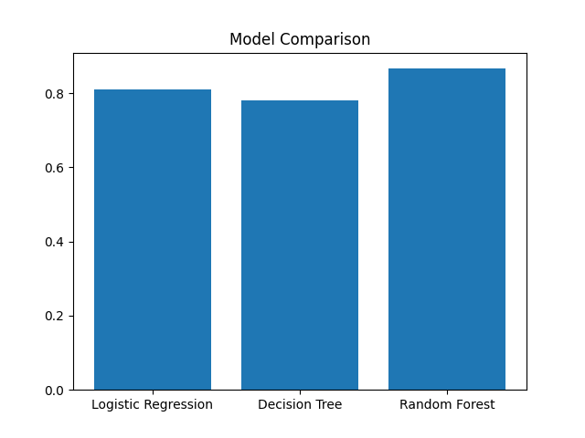

# 🚀 Customer Churn Prediction (End-to-End Data Analytics & ML Project)

## 📌 Overview

This project builds a complete **customer churn prediction system** using real-world data.
It covers everything from **data analysis → visualization → machine learning → business insights**.

The goal is to help businesses **identify customers likely to leave (churn)** and take action to retain them.

---

## 🎯 Problem Statement

Customer churn is a major problem in industries like banking, telecom, and SaaS.

> ❗ Acquiring a new customer is 5x more expensive than retaining an existing one.

This project predicts:

* Which customers are likely to churn
* What factors influence churn
* How businesses can reduce churn

---

## 🧠 Solution Approach

### 1️⃣ Data Processing

* Removed irrelevant columns (CustomerId, Surname, RowNumber)
* Handled categorical variables using encoding
* Renamed target column (`Exited → churn`)

### 2️⃣ Exploratory Data Analysis (EDA)

* Churn distribution analysis
* Age vs churn
* Balance vs churn
* Correlation heatmap

### 3️⃣ Feature Engineering

* Converted categorical data into numerical format
* Scaled features using StandardScaler

### 4️⃣ Machine Learning Models

* Logistic Regression
* Decision Tree
* Random Forest (Best Model)

---

## 📊 Model Performance

| Model               | Accuracy      |
| ------------------- | ------------- |
| Logistic Regression | ~0.81         |
| Decision Tree       | ~0.78         |
| Random Forest       | **Highest ✅** |

👉 **Final Model:** Random Forest

---

## 📈 Key Visualizations

### 🔹 Churn Distribution



### 🔹 Age vs Churn



### 🔹 Balance vs Churn



### 🔹 Feature Correlation



### 🔹 Model Comparison



---

## 🧪 Tech Stack

* Python 🐍
* Pandas
* NumPy
* Matplotlib / Seaborn
* Scikit-learn
* Jupyter Notebook
* Git & GitHub

---

## 🗄️ SQL Analysis

Performed SQL-based analysis to extract key insights:

- Customer distribution across regions
- Average balance by gender
- Churn distribution
- Impact of active membership on churn
- Relationship between number of products and churn

SQL queries are available in:
scripts/queries.sql

## 📁 Project Structure

```
customer-churn-prediction/
│
├── data/
│   └── customer_churn.csv
│
├── notebooks/
│   └── churn_analysis.ipynb
│
├── visuals/
│   ├── churn_distribution.png
│   ├── age_vs_churn.png
│   ├── balance_vs_churn.png
│   ├── correlation_heatmap.png
│   └── model_comparison.png
│
└── README.md
```

---

## 💡 Business Insights

* Customers with **low activity** are more likely to churn
* Customers with **higher balance** show different churn patterns
* **Age and tenure** significantly impact customer retention
* Customers with **fewer products** are at higher risk
* **Active members are less likely to leave**

---

## 🏆 Key Learnings

* End-to-end ML pipeline implementation
* Real-world data preprocessing
* Feature engineering & scaling
* Model evaluation & comparison
* Translating data into business insights

---

## 🚀 Future Improvements

* Hyperparameter tuning
* Use advanced models (XGBoost, LightGBM)
* Deploy model using Flask / FastAPI
* Build dashboard using Power BI

---

## 👨‍💻 Author

**Yaswanth Bandalapati**

---

## ⭐ If you like this project

Give it a ⭐ on GitHub and share your feedback!
